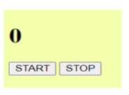
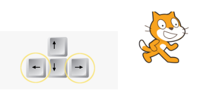

# JavaScript Day 4 Tasks: Event Listeners

---

## Assignment 1: Button Clicks

Add a button to your webpage. When this button is clicked, display an alert message saying **"Welcome to my site"**. _(Use an event listener)._

---

## Assignment 2: Stop Watch

Develop a basic stopwatch that allows users to start and stop the timer. The stopwatch should continuously display the elapsed time in seconds.

---

## Assignment 3: Theme Toggle (Light / Dark)

Create a button that toggles the page's theme between Light mode and Dark mode using an event listener.

---

## Assignment 4: Prevent Page Refresh

Prevent the default behavior of the **F5** key to stop the page from refreshing.
**Bonus:** Prevent the default behavior of **Ctrl + R** as well.

---

## Assignment 5: Add Dynamic Images

Create an input field for an image URL and an "Add" button. By entering a URL in the input and clicking the button, a list of images should appear underneath.
**Bonus:** Allow the user to configure the width and height of the image before adding it.

---

## Assignment 6: Password Validation

Create a form with "Password" and "Confirm Password" fields. Check the validation of the confirm password. If both passwords don't match, print an error message.

---

## Assignment 7: Move Image with Arrow Keys (Bonus)

Use an image on your page. Handle the `keydown` event so that when the pressed key is **ArrowLeft**, the image moves to the left, and when the pressed key is **ArrowRight**, the image moves to the right.

