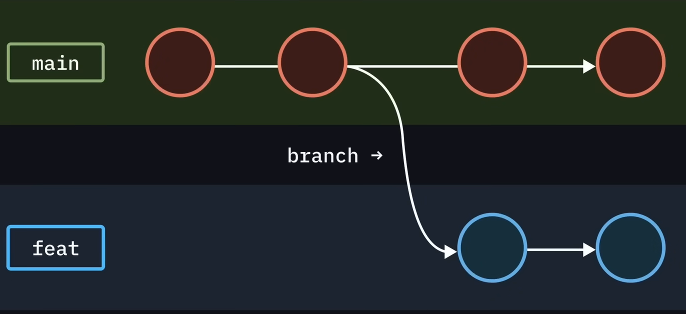
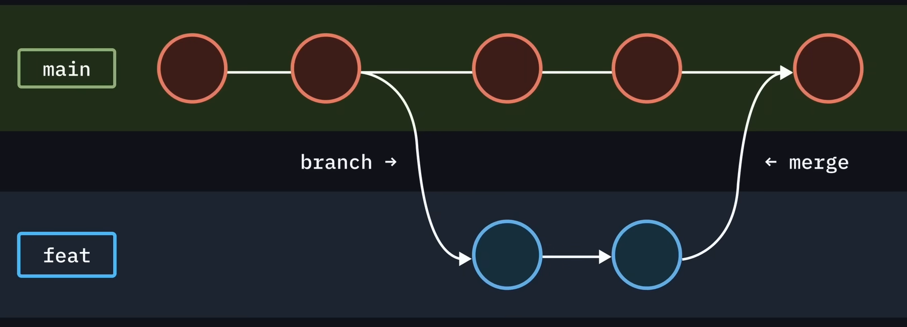

# Git Fundamentals - Day 1

### Badr Aldien Soliman

---

## 1. What is Git and Why Use It?

### What is Git?

Git is a distributed version control system that tracks changes in your code over time. Think of it as a time machine for your projects - you can see what changed, when it changed, and who changed it.

### Why Use Git?

- **Track & Revert**: Monitor changes and travel back in time.
- **Collaboration**: Coordinate seamlessly with other developers.
- **Experimentation**: Safely test new ideas without breaking code.
- **Reliability**: A permanent, secure backup of your progress.

---

### Git History

- **Created by**: Linus Torvalds (also creator of Linux)
- **Released**: April 2005
- **Why created**: Needed a fast, distributed version control system for Linux kernel development after issues with existing tools

> **Important Note**: Git ≠ GitHub
> - **Git**: The version control system (runs on your computer)
> - **GitHub**: A cloud platform that hosts Git repositories (we'll cover this tomorrow)

---

## 2. Installation and Setup

### Installation

- **Windows**: Download from [git-scm.com](https://git-scm.com)
- **Mac**: Install via Homebrew: `brew install git` or download from [git-scm.com](https://git-scm.com)
- **Linux**: `sudo apt install git` (Ubuntu/Debian) or `sudo yum install git` (RHEL/CentOS)

---

### Initial Configuration


After installation, set up your identity:

```bash
git config --global user.name "Your Name"
git config --global user.email "your.email@example.com"
```
---

Verify your configuration:

```bash
git config --list
```
Output:
```bash
init.defaultbranch=master
user.name=Your Name
user.email=email@outlook.com
```

---

## 3. Understanding Repositories

### What is a Repository (Repo)?

A repository is like a special folder that:

- Stores all versions of your code
- Tracks every change you make
- Contains the complete history of your project
- Can exist locally (on your computer) and remotely (on servers)

---

## 4. Creating Your First Repository

### Step 1: Create a Project Folder

```bash
mkdir my-first-project
cd my-first-project
```

### Step 2: Initialize Git

```bash
git init
```
*This creates a hidden `.git` folder that stores all version control information.*

---

### Step 3: Change Default Branch Name

Modern practice uses `main` instead of `master`:

```bash
git branch -M main
```

---

## 5. Tracking Files and Making Commits

### Check Repository Status

```bash
git status
```

This shows:
- **Untracked files**: New files Git doesn't know about
- **Modified files**: Changed files Git is watching
- **Staged files**: Files ready to be committed

---

### Add Files to Tracking

```bash
# Add a specific file
git add filename.txt

# Add all files in current directory
git add .

# Add all files of a specific type
git add *.js
```

---

### What is a Commit?

A commit is like taking a snapshot of your project at a specific moment. Each commit:
- Records what changed
- Includes a message describing the change
- Gets a unique ID (hash)
- Becomes part of your project's permanent history

### Making Your First Commit

```bash
git commit -m "Add initial project files"
```

---

### Commit Message Best Practices

Write commit messages in imperative mood (like giving commands):

✅ **Good Examples**:
- "Add user authentication"
- "Fix login bug"
- "Update navigation menu"

❌ **Bad Examples**:
- "Added user authentication" (past tense)
- "Adding user authentication" (present continuous)
- "Fixed stuff" (not descriptive)

---

## 6. Viewing Project History

### Check Commit History

```bash
git log
```

This shows:
- **Commit Hash**: Unique identifier (most important!)
- **Author**: Who made the commit
- **Date**: When it was made
- **Message**: Description of changes

`Note: git log --oneline` shows the same information in a compact format.


---

## 7. Time Travel with Git

### Go Back to Previous Commit

```bash
git checkout [commit-hash]

# Example:
git checkout a1b2c3d
```

### Understanding Detached HEAD

Checking out a specific commit puts you in a **Detached HEAD** state.

- You are viewing a past snapshot, not the current branch.
- **Caution**: Any new commits will be lost unless you start a new branch.

---

### Return to Latest Version

```bash
git checkout main
```

### Force Return (Discard Changes)

```bash
git checkout -f main
```
> ⚠️ **Warning**: This discards any uncommitted changes!

---

## 8. Working with Branches

### What are Branches?


Branches let you work on different features simultaneously:
- **main**: Your stable, production-ready code
- **feature branches**: Experimental or new feature development

---



---




---

### View All Branches

```bash
git branch
```

### Create a New Branch

```bash
# Create and switch to new branch
git checkout -b new-feature

# Alternative: Create branch without switching
git branch new-feature
git checkout new-feature

# Copy from specific branch
git branch new-feature main
```

---

### Branch Naming Conventions

Use kebab-case (lowercase with hyphens):

- ✅ `user-authentication`
- ✅ `fix-login-bug`
- ❌ `UserAuthentication` (PascalCase - not for branches)
- ❌ `user_authentication` (snake_case - not preferred)

---

### Switch Between Branches

```bash
git checkout branch-name
```

**Important: Branch Creation Timing**
When you create a branch, it copies the current state of the code from wherever you are.
- Create from `main` to start fresh
- Create from another branch to build upon that work

---

## 9. File Management with Git

### Deleting Files

**Method 1: Delete from Computer Then Tell Git**
```bash
rm filename.txt
git add filename.txt # Stage the deletion
git commit -m "Remove filename.txt"
```
---

**Method 2: Use Git to Delete**
```bash
# Delete single file
git rm filename.txt

# Delete directory
git rm -r directory-name

git commit -m "Remove files"
```
> Note: Avoid `rm -rf` as it's dangerous and can delete everything!

---

## 10. Typical Workflow Summary

1. **Start**: `git init` (once per project)
2. **Work**: Make changes to your files
3. **Check**: `git status` (see what changed)
4. **Stage**: `git add .` (prepare changes)
5. **Save**: `git commit -m "Descriptive message"`
6. **Repeat**: Steps 2-5 for each logical change
7. **Branch**: `git checkout -b feature-name` (for new features)
8. **History**: `git log` (review your progress)

---

## 11. Key Concepts Review

### Essential Git Terms

- **Repository**: Project folder with version control
- **Commit**: Snapshot of your project at a point in time
- **Hash**: Unique identifier for each commit
- **Branch**: Parallel version of your code
- **HEAD**: Pointer to your current location
- **Staging Area**: Where files wait before being committed


---

# Read the error again!

## **[badrsoliman.com](https://www.badrsoliman.com)**
